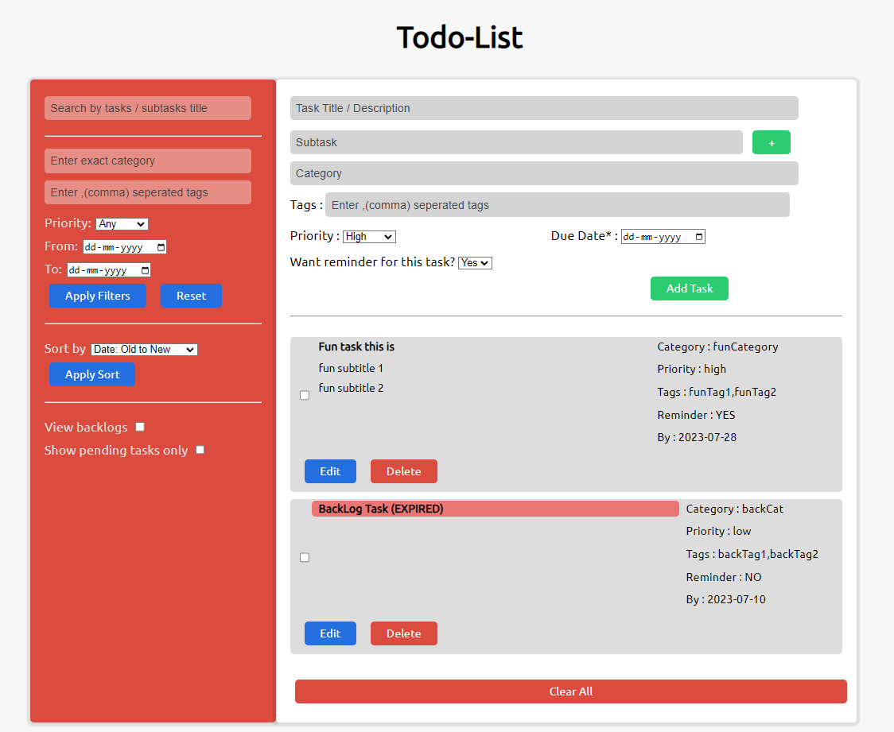
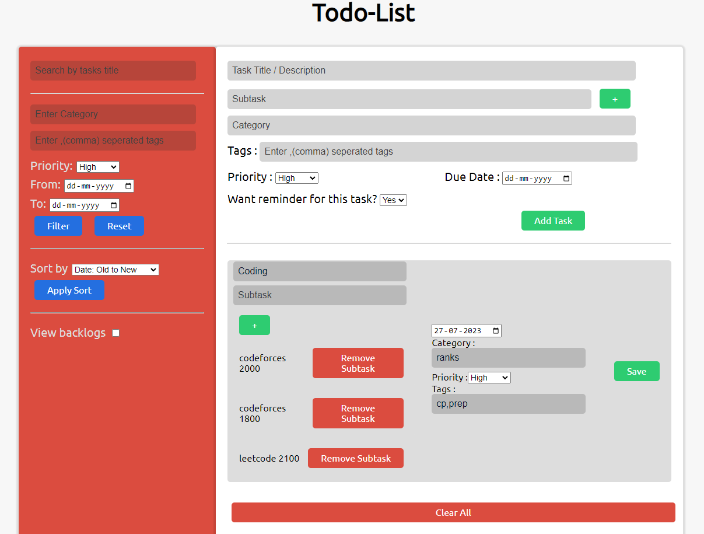

# CogoportTodoList

         

### Todo-list application with the following features:
- Add Todo: Users can add new tasks to the todo list.
- Edit Todo: Users can edit the details of existing tasks.
- Delete Todo: Users can remove tasks from the todo list. 
- Mark as Done: Users can mark tasks as completed.
- Mark as Undone: Users can mark completed tasks as undone.
- Add Category: Users can categorize tasks to organize them better. 
- Store Todo in Local Storage: The todo list will be stored in the browser's local storage to persist the data. 
- Add Due-date to Todo: Users can set due-dates for tasks to track deadlines. 
- Priority: Tasks can be assigned a priority level (low, medium, high). 
- Filters:
  1. Due Date: Users can filter tasks based on a specific due date range.
  2. Category: Users can filter tasks based on categories.
  3. Priority: Users can filter tasks based on priority levels.
- Subtasks: Users can create subtasks under main tasks for better task management. 
- Tags: Users can add tags to tasks for easy identification and grouping. 
- Sorting: Users can sort the tasks based on due date, priority, etc.
- View Backlogs: Users can view tasks that are pending or missed. 
- Search:
  1. Exact Todo: Users can search for a specific task using its exact name.
  2. Sub-tasks: Users can search for tasks based on their subtasks.
  3. Partial Search: Users can search for tasks using partial keywords.
  4. Tags: Users can search for tasks based on specific tags.
- Reminders (Cron): Users can set reminders for important tasks.

